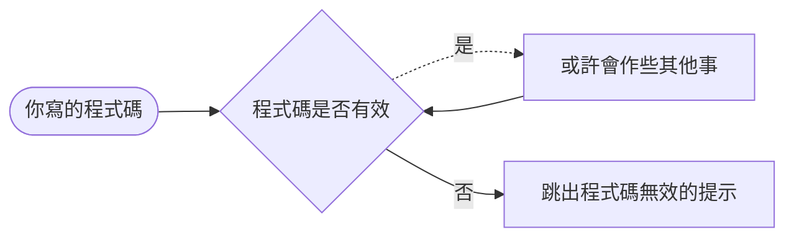

##  JavaScript 全攻略：克服 JS 的奇怪部分（目錄）

- Conceptual Aside：觀念小叮嚀

 - [執行環境 Execution Context](執行環境%20Execution%20Context.md)

## 詞彙環境 Lexical Environment
程式碼的所在位置，代表他所在記憶體的位置

>對 JavaScript 來說，程式碼「在哪裡」，「這個地點有什麼」都很重要

```js
function fn() {
	var a = 'hi'	// a sits lexically inside the fn()
}
```

## 語法解析器 Syntax Parsers
- 將你寫的程式碼 --（如果你的程式碼是有效的）--> 電腦看得懂的程式
- 他可能是一個直譯器或編譯器

