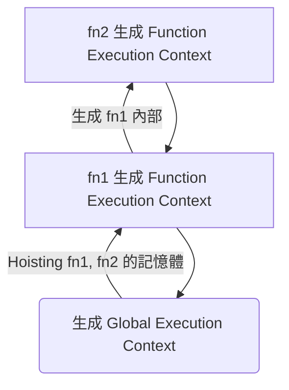

##  JavaScript 全攻略：克服 JS 的奇怪部分（目錄）


- [執行環境 Execution Context](執行環境%20Execution%20Context.md)
- [詞彙環境 Lexical Environment](詞彙環境%20Lexical%20Environment.md)
- [語法解析器 Syntax Parsers](語法解析器%20Syntax%20Parsers.md)
- [Key-Value Pair](Key-Value%20Pair.md)
- [Object](Object.md)
- [undefined](undefined.md)
- [Single-thread](Single-thread.md)

## Invocation 呼叫函數
```js
function fn() {
	console.log('invocated!')
}

// 這就是 Invocation
fn()
```


## stack
當程式碼「執行」時，按照 [Call Stack 呼叫堆疊]，經歷兩個階段
- 背景運作：[Creation Phase](Creation%20Phase.md)：如果背景運作完就可以馬上
- 實際運作：[Execution Phase](Execution%20Phase.md)


```js
function fn1() {
	fn2()
}

function fn2() {
	console.log('fn2 is invocated!')
}

fn1() // invocated fn1
```


