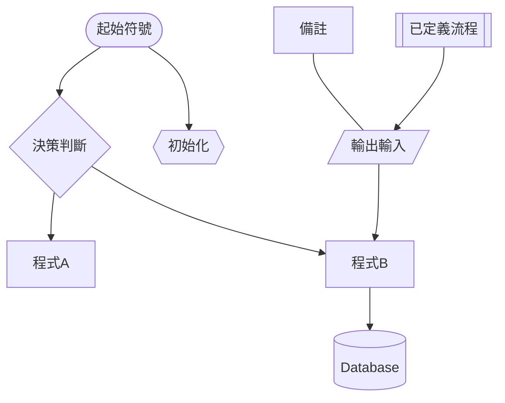

## Mermaid.js  Markdown 的心智圖語法
>- [doc](https://mermaid-js.github.io/mermaid/#/flowchart)
>- [live-editor](https://mermaid-js.github.io/mermaid-live-editor/edit#pako:eNpVkE1qw0AMha8itEohvoAXhcZOsgk0kOw8XgiPkhnC_DCWKcH23TuOCbRaSXrfewiN2AXNWOI9UTRwrZWHXF9NZZLtxVHfQlF8TkcWcMHzc4Ld5higNyFG6-8fK79bIKjG04IxiLH-Ma9S9fJ_e56gbk4UJcT2r3L9CRPsG3s2Of6_YhJn16G5UXmjoqMEFaUWt-g4ObI6nz0uBoVi2LHCMrea0kOh8nPmhqhJeK-thISlpIG3SIOEy9N373llakv5A25dzr-75Fn6)
>- [流程圖圖像解釋](https://zh.wikipedia.org/wiki/%E6%B5%81%E7%A8%8B%E5%9B%BE)

