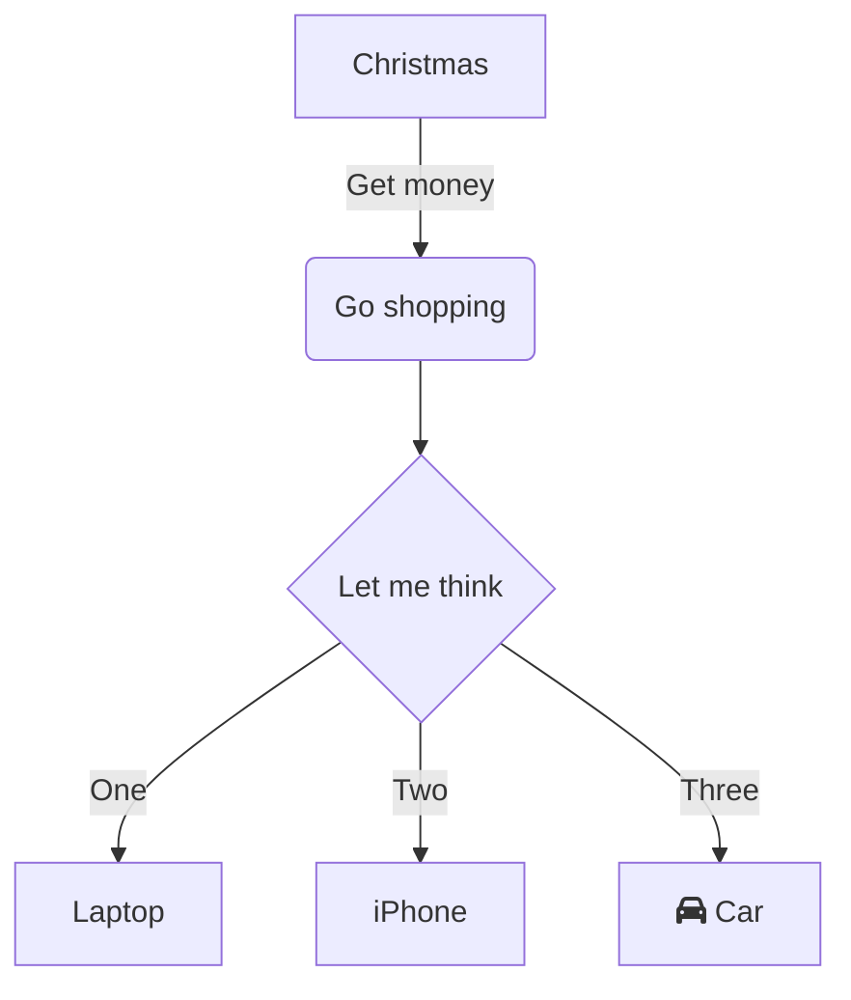
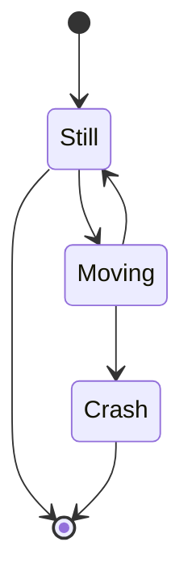

## Mermaid.js  Markdown 的心智圖語法
>- [repo](https://github.com/mermaid-js/mermaid/blob/develop/docs/Tutorials.md)
>- [範例寫法](https://mermaid-js.github.io/mermaid-live-editor/edit#pako:eNpVkE1qw0AMha8itEohvoAXhcZOsgk0kOw8XgiPkhnC_DCWKcH23TuOCbRaSXrfewiN2AXNWOI9UTRwrZWHXF9NZZLtxVHfQlF8TkcWcMHzc4Ld5higNyFG6-8fK79bIKjG04IxiLH-Ma9S9fJ_e56gbk4UJcT2r3L9CRPsG3s2Of6_YhJn16G5UXmjoqMEFaUWt-g4ObI6nz0uBoVi2LHCMrea0kOh8nPmhqhJeK-thISlpIG3SIOEy9N373llakv5A25dzr-75Fn6)





```mermaid
graph TD
 A([起始符號]) --> B{決策判斷}

 B --> C[程式A]
 B --> D[程式B]
 E[/輸出輸入/] --> D
 F[備註] --- E
 G[[已定義流程]] --> E
 
 C --> 
```